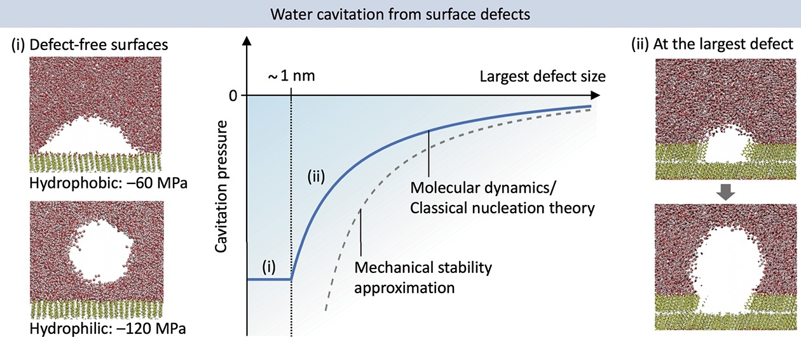
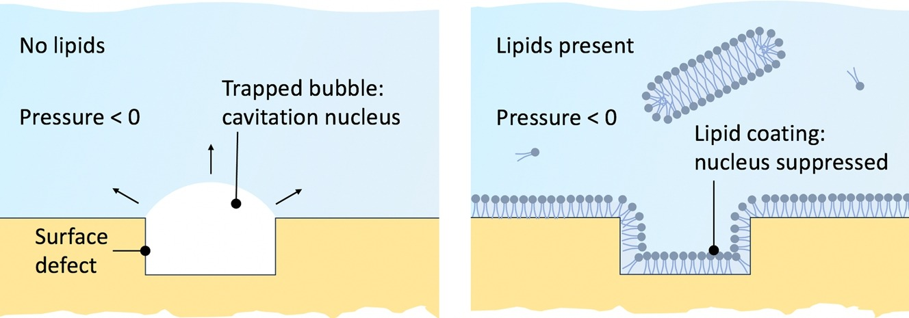

# Pressure ramp molecular dynamics (MD) simulation
Code accompanying the following articles: \
[Impact of nanoscopic impurity aggregates on cavitation in water](https://doi.org/10.1016/j.surfin.2025.106243) \
[Nanoscale defects and heterogeneous cavitation in water](https://doi.org/10.1016/j.molliq.2025.127797) \
[How lipids suppress cavitation in biological fluids](https://doi.org/10.1016/j.jcis.2025.139286).

This repository contains Gromacs input files and a Python script to perform pressure ramp molecular dynamics simulation of a decane droplet.

   

   

   

## Requirements
- Gromacs must be installed and loaded/sourced into the shell, or shell script. \
  Any fairly up-to-date version of Gromacs should work. We used Gromacs 2022.1.
- Python 3.11, or newer, is recommended. \
  It will probably work with slightly older Python versions (e.g., 3.10), but this has not been tested. \
  Most likely will not work with very old Python versions.
- Required Python packages are listed in requirements.txt

## Running the pressure ramp MD simulations
The simulations are performed using the 'variable_pressure_sim.py' script. The script expects a template folder with necessary files for running the simulations 
(such as Gromacs input configuration, force field files, water model, etc.), copies all the files from the template folder into a new folder named 'run_#' 
(for example run_12, if folders run_1 to run_10 exist). The script will then perform a series of sequential molecular dynamics simulations until a cavitation event occurs, 
after which the script analyses the output trajectories to pinpoint the cavitation event and determine the cavitation pressure at which the event occurred. 

Example of how to start the pressure ramp simulation: \
**python variable_pressure_sim.py -wd decane_water/10nm -config decane_water/10nm/conf_-1.ini -mdrun_args "-nt 8 -ntmpi 1 -ntomp 8"**

### Arguments
- -wd/--workdir [str]: Path to the directory where the simulation will run. \
   The path must contain a subdir named 'templates' which contains the force field, water model, input configuration, etc. \
   See folder structure under 'gromacs_input_files' for an example of the 'templates' folder.
- -mdrun_args/--mdrun_arguments [str]: Any additional arguments that you want to forward to 'gmx mdrun' command, such as number of threads/cores, mpi configurations, gpu id, etc.
- -config/--config [str]: Path to the config file that contains input parameters for the pressure ramp. \
   See 'conf_-1.ini' for an example of how this file should look like.
- -r/--restraint [str]: Must be 'None', 'Fixed' or 'Moving', any other value will raise an error. Whether to use positional restraints or not: 
   * 'None' == Do not use positional restraints
   * 'Fixed' == Use positional restraints with positional restraints reference points that are fixed to the initial points before pressure ramp simulation started.
   * 'Moving' == Use positional restraints with positional restraints reference points that are changed after each short simulation and are set to input of the current short simulation.
- -an/--analysis [None]: A flag/switch to concatenate trajectory fragments into one trajectory and analyse it to pinpoint cavitation event and determine the cavitation pressure at which it occurred. This part of the code is normally automatically executed after all the simulations are done.
- -log/--log [None]: A flag/switch to redirect stdout and stderr into a log file. The log file will be named 'VARIABLE_PRESSURE_SIM_{current_datetime}.log'
- -cr/--continue_run [int]: **[Deprecated functionality, not guaranteed to work]** Must be 0 or 1. Used to continue the pressure ramp from the last simulation fragment, instead of from initial starting point, in the case that the simulation was prematurely interrupted.

### Config file

The config file is required and used to control how the pressure ramping behaves.
- P_RATE: Pressure rate in units of bar / ns
- DELTA_P: Amount by which the pressure is changed (in units of bar) in between each sequential short MD simulation.
- P_MAX: Maximum pressure (in units of bar) that a simulation is allowed to reach. If the cavitation event still has not occurred by that point the simulation will be terminated.\
  Used to implement the pressure steps. The exact value is not critical, as long as it is set much higher than the expected cavitation pressure.
- P_START: The pressure (in units of bar) at which the pressure ramp simulations starts. \
  Starting from p = 0 is typically a waste of computational resources, as nothing interesting happens before the pressure reaches values close to the cavitation pressure. \
  Recommended to set this parameter 50 to 100 bar less than the expected cavitation pressure.
- dt: MD time step in units of ns. Typical value is 2 fs, i.e. dt = 2 * 10**(-6)

### Gromacs input files

Input files: initial configurations for decane droplet in water, gromacs md input parameters, force field and water model are located under 'gromacs_input_files'.\
Folder names 5nm, 7nm, 10nm and 12nm refer to the diameter of the decane droplet.
